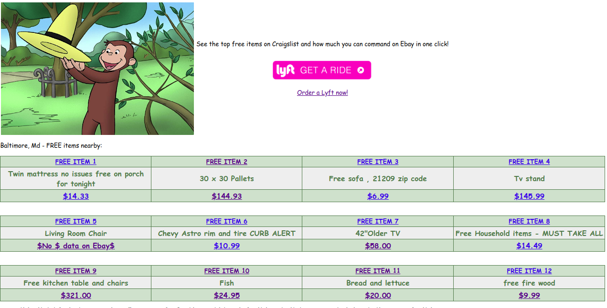
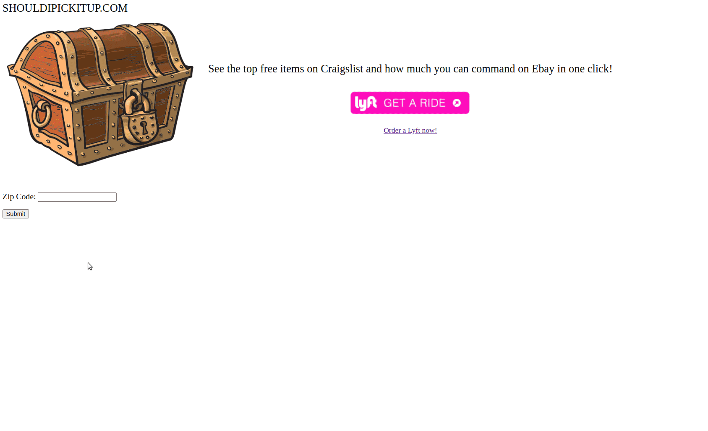

# shouldipickitup(.com) > Given a free listing on Craiglist, should I pick it up?  
NOTES:
 - This project is intentionally "in progress".
 - It serves for inspiration for anyone to learn Python, Flask, MongoDB, Devops principles.
 - And for fun. Feedback or Collaborators Welcome.
 - Shout out to [Gary V](https://www.instagram.com/p/B5ghkSqAduP/)

## High Level Web Site Mockup



## Peek Screen Gif


## High Level Command line Usage example

```

In [21]: %run craigs_lyft_ebay.py
"Dish Drying Rack" is Free on Craigslist, is selling for $14.99 on Ebay and is 0.46 miles away from you.
 Using Lyft it will cost between 9.0 and 12.0 dollars to pick up.


"Bathroom rug" is Free on Craigslist, is selling for $5.99 to $18.99 on Ebay and is 0.46 miles away from you.
 Using Lyft it will cost between 8.0 and 10.0 dollars to pick up.


"Twin Bed Frame" is Free on Craigslist, is selling for $57.99 to $77.99 on Ebay and is 0.46 miles away from you.
 Using Lyft it will cost between 8.0 and 10.0 dollars to pick up.


"Side table with drawer -- West Elm?" is Free on Craigslist, is selling for $350.00 on Ebay and is 0.20 miles away from you.
 Using Lyft it will cost between 8.0 and 10.0 dollars to pick up.


"Free iron" is Free on Craigslist, is selling for $3.49 on Ebay and is 0.56 miles away from you.
 Using Lyft it will cost between 9.0 and 12.0 dollars to pick up.


"Free stuff" is Free on Craigslist, is selling for $19.99 on Ebay and is 0.48 miles away from you.
 Using Lyft it will cost between 8.0 and 10.0 dollars to pick up.


"LG V 10 bettery new." is Free on Craigslist, is selling for $7.40 on Ebay and is 0.46 miles away from you.
 Using Lyft it will cost between 9.0 and 12.0 dollars to pick up.


"FREE! Drawer Organizers" is Free on Craigslist, is selling for $17.99 on Ebay and is 0.31 miles away from you.
 Using Lyft it will cost between 9.0 and 12.0 dollars to pick up.


"FREE! Cat Bed" is Free on Craigslist, is selling for $59.99 on Ebay and is 0.20 miles away from you.
 Using Lyft it will cost between 8.0 and 10.0 dollars to pick up.


"FREE BROKEN SPEIDEL WATCH BAND STRAP MADE IN USA SILVER" is Free on Craigslist, is selling for $9.95 on Ebay and is 0.58 miles away from you.
 Using Lyft it will cost between 9.0 and 12.0 dollars to pick up.


"4 lbs Poly-fil" is Free on Craigslist, is selling for $60.99 on Ebay and is 0.12 miles away from you.
 Using Lyft it will cost between 10.0 and 12.0 dollars to pick up.

```


## Release History
* 0.5.7
    * CHANGE: http://beta.shouldipickitup.com/ has launched with the intent to be stable/up %100
* 0.5.6
    * CHANGE: Integrate PAAS - hosted  MongoDB Atlas
* 0.5.5
    * CHANGE: Automate ALL the IAM Role Creation Task. (From New AWS Account to full Deploy in one command)
* 0.5.4
    * CHANGE: Docker-compose used with docker names (one 'click' deploy)
* 0.5.3
    * CHANGE: passed Nessus Web Scans; Locked down nginx configs; use non-root users in all containers
* 0.5.2
    * CHANGE: Dockerized - 3 containers using  Docker Networking'
* 0.5.1
    * http://dev.shouldipickitup.com/ has launched (no uptime guarantee; still testing)
* 0.5.0
    * CHANGE: Use Gunicorn 20.0.4 as WSGI server and Nginx as Website with proxy_pass
* 0.4.4
    * CHANGE: Crawl Ebay data and display it again
* 0.4.3
    * CHANGE: Added CSS and set default to 12 displayed items
* 0.4.2
    * CHANGE: Update Docstrings (module code remains unchanged)
* 0.4.1
    * CHANGE: Change how data is munged and loaded into Mongo 
* 0.3.X
    * CHANGE: Use Mongdb; rm Memcached 
* 0.2.X
    * CHANGE: Incorporate Flask
* 0.1.X
    * Testing MemCached and Basic Setup

## Installing
```
git clone https://github.com/jouellnyc/shouldipickitup.git
cd shouldipickitup
docker-compose  up -d
```

## Architechure
- Nginx will listen on the local host's port 80
- Flask and Mongodb will listen on port 8000 and 27017 respectively of the Docker Containers only
- All 3 will be on the same 'bridged' docker network reachable by docker 'names'

## Requirements
git/docker/docker-compose

## Meta
John Ouellette – [@jjouell](https://twitter.com/jjouell) – twitter[1:]@gmail.com

## Contributing

1. Fork it (<https://github.com/jouellnyc/shouldipickitup>)
2. Create your feature branch (`git checkout -b feature/fooBar`)
3. Commit your changes (`git commit -am 'Add some fooBar'`)
4. Push to the branch (`git push origin feature/fooBar`)
5. Create a new Pull Request

